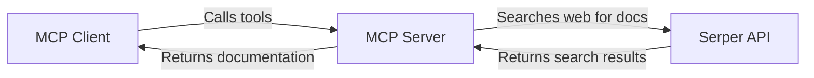

## MPC Docs Server

[](https://smithery.ai/server/@joaowinderfeldbussolotto/MCP-Websearch-Server)

This is a simple MCP (Model Context Protocol) server for retrieving information from the official documentation of Langchain, Llama Index, and OpenAI. It provides a tool that can be used by MCP-compatible applications to search and retrieve relevant documentation snippets.

## Features

-   **Documentation Retrieval:** Fetches content from the official documentation of Langchain, Llama Index, and OpenAI.
-   **MCP Compatibility:** Implements an MCP server, allowing it to be easily integrated with other MCP-compatible applications.
-   **Simple Tool:** Exposes a `get_docs` tool that accepts a query and library name, returning relevant documentation snippets.

## How It Works



## Getting Started

### Installing via Smithery

To install Documentation Retrieval Server for Claude Desktop automatically via [Smithery](https://smithery.ai/server/@joaowinderfeldbussolotto/MCP-Websearch-Server):

```bash
npx -y @smithery/cli install @joaowinderfeldbussolotto/MCP-Websearch-Server --client claude
```

### Installing uv Package Manager

**On MacOS/Linux:**
```bash
curl -LsSf https://astral.sh/uv/install.sh | sh
```

Make sure to restart your terminal afterwards to ensure that the `uv` command gets picked up.

### Project Setup

Create and initialize the project:
```bash
# Create a new directory for our project
uv init mcp-server
cd mcp-server

# Create virtual environment and activate it
uv venv
source .venv/bin/activate  # On Windows use: .venv\Scripts\activate

# Install dependencies
uv add "mcp[cli]" httpx python-dotenv bs4
```


### Environment Variables

Create a `.env` file in the root directory and add the following:

```
SERPER_API_KEY=YOUR_SERPER_API_KEY
```

You'll need a SERPER API key to use the web search functionality. You can obtain one from [Serper.dev](https://serper.dev/). We are using the Serper API to search the web for relevant documentation.

### Running the Server

Start the MCP server:
```bash
uv run main.py
```

The server will start and be ready to accept connections.
